# FrameLab · 平面 / 三维结构分析器

一个**纯前端、零依赖**的结构分析工具，运行在浏览器中。**2D 模式**采用**直接刚度法**对**框架 / 平面 / 壳**单元进行线弹性分析；**3D 模式**支持空间杆系（6 自由度/节点）与共面膜墙，四窗口（平面 / X 向剖面 / Y 向剖面 / 3D 轴测）联动显示。可生成位移云图、弯矩/剪力/轴力图、面应力云图（von Mises、σx、σz、τxz、主应力、膜内力），并支持在任意截面读取内力和在每个面单元读取应力（SAP2000 风格的定位点）。内置**多文档标签页**（每个标签一项计算文件）、**模型保存/打开**、**亮/暗主题**与**单位切换**（m/mm、kN/N），附带 GB 规范钢 / 混凝土构件设计后处理。

> **坐标体系（2D/3D 统一）**：二维平面即 **X-Z 平面**（X 水平、Z 竖向，与 SAP2000 一致），Y 为面外方向。
> 节点自由度为 `ux、uz、ry`，节点荷载为 `Fx、Fz、My`，面荷载为 `qx、qz`，面应力为 `σx、σz、τxz`。
> 二维模型直接落在三维空间的 `y=0` 平面上：计算时仅约束面外自由度（`uy、rx、rz`），不施加 Y 向荷载时 2D/3D 结果一致。
> 旧版文件（X-Y 平面：`uy/rz/Fy/Mz/qy/σy/τxy`）打开时自动迁移，结果数值不变。

> 单文件 `index.html`，无需安装、无需后端，双击或用浏览器打开即可使用。

**在线演示**：https://song4875343.github.io/framelab/

---

## 🖼️ 界面截图

**位移云图**（2 跨 3 层框架，含节点荷载与顶层梁均布荷载）

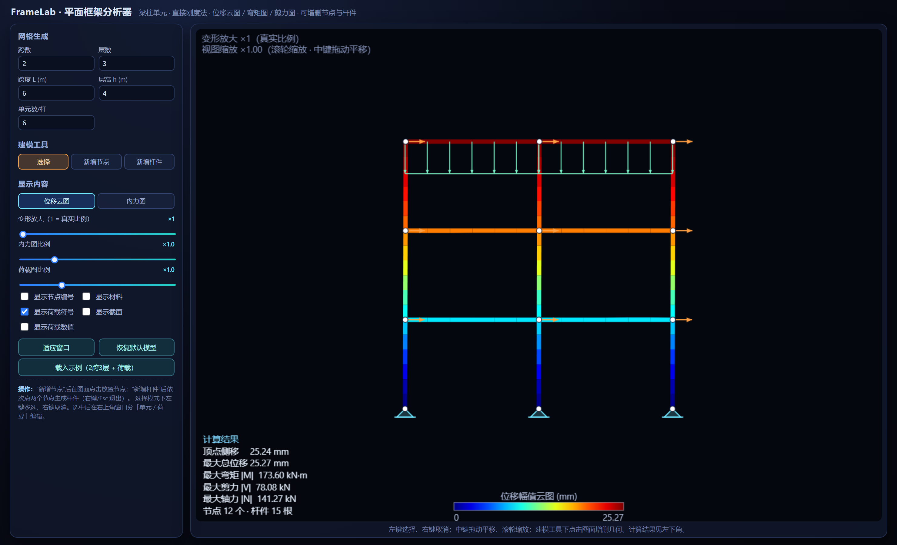

**弯矩图**

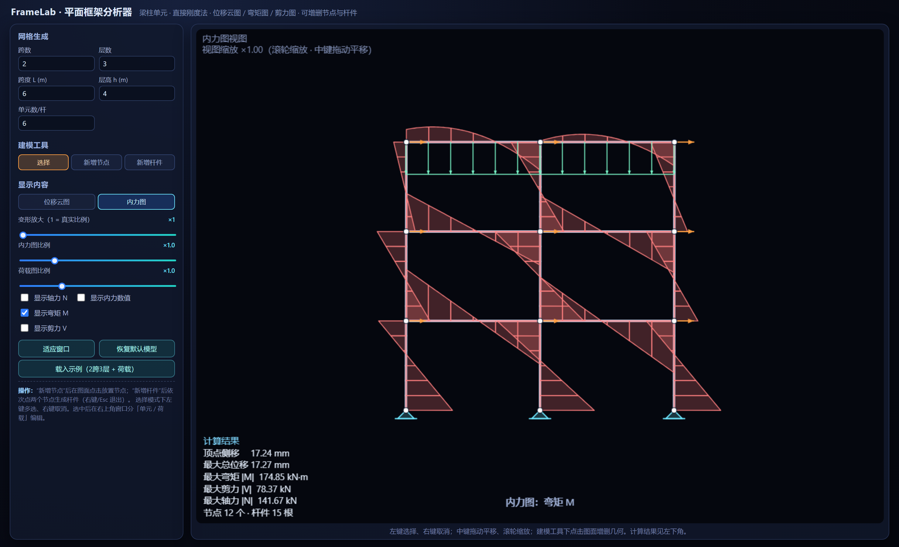

**杆件内力面板**：荷载 / 轴力 / 剪力 / 弯矩四张小图，滑杆同步定位线读取截面内力

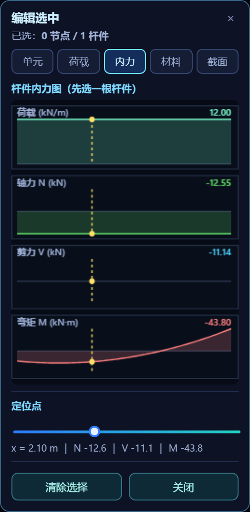

**材料与截面**：可选钢材 / 混凝土 / 铝等常见材料与矩形 / 圆形 / 工字形截面，自动计算截面特性与单元刚度

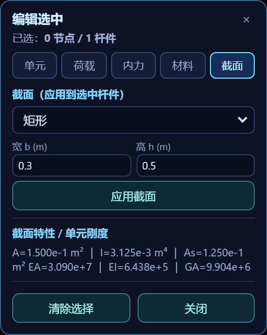

**显示材料与截面**：杆件旁自动标注材料与截面（如 `C30 矩0.2x0.6`），文字大小随「荷载图比例」滑杆调节

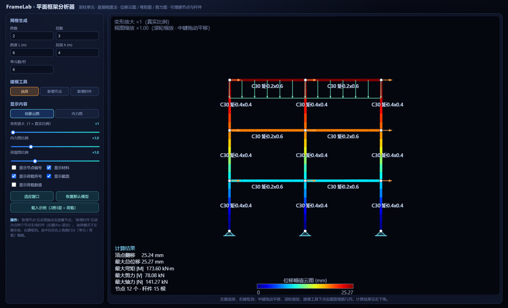

**建模图**：显示骨架、节点编号、支座与荷载符号，纯几何视图

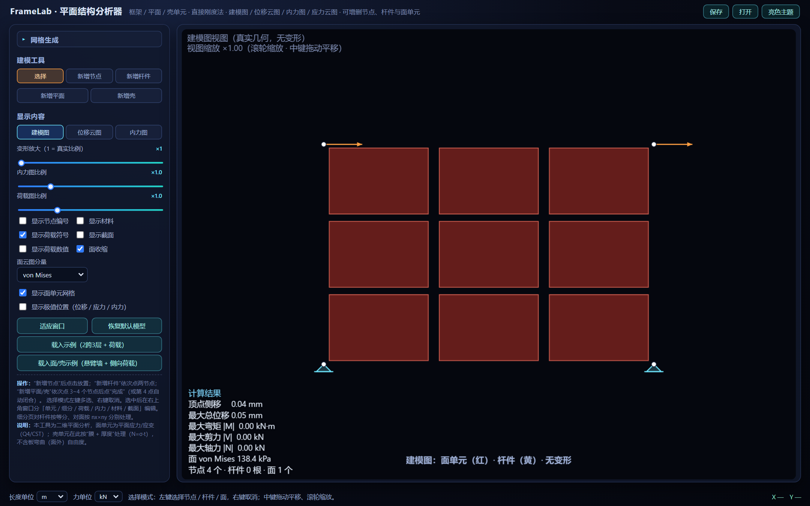

**面/壳位移云图**（悬臂墙 + 侧向荷载，含拖动式色标范围条）

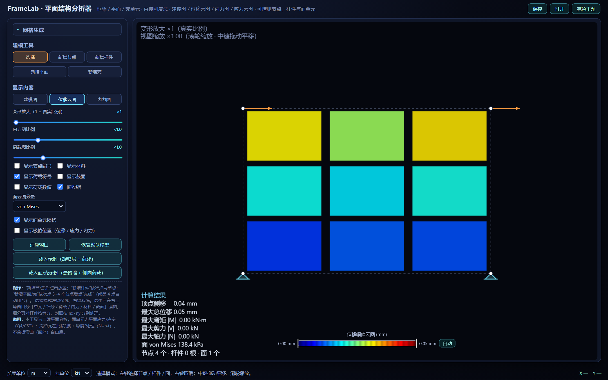

**面应力云图**（von Mises / σx / σy / τxy / 主应力 / 膜内力）

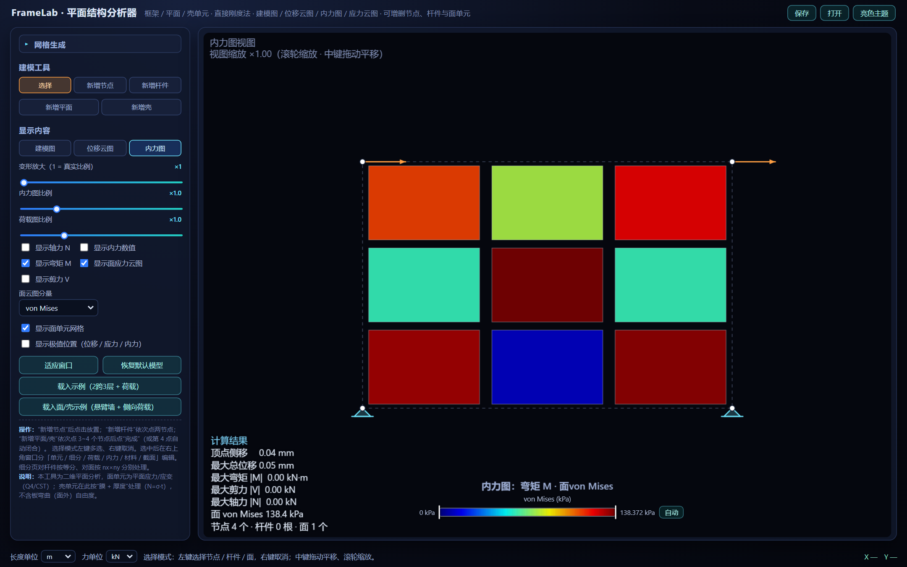

**面应力读取**：选中面单元后显示子单元平均应力与膜内力

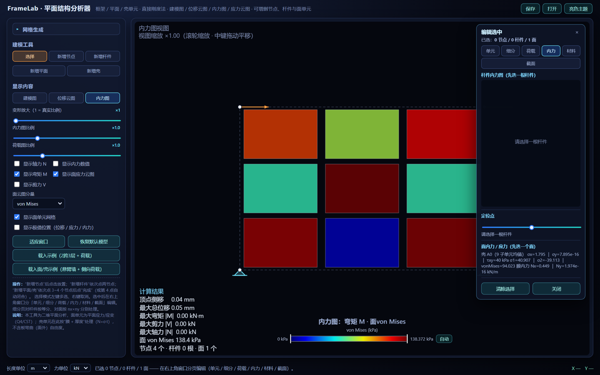

**极值位置标注**：勾选「显示极值位置」后在位移 / 应力 / 内力极值处标记并标注数值

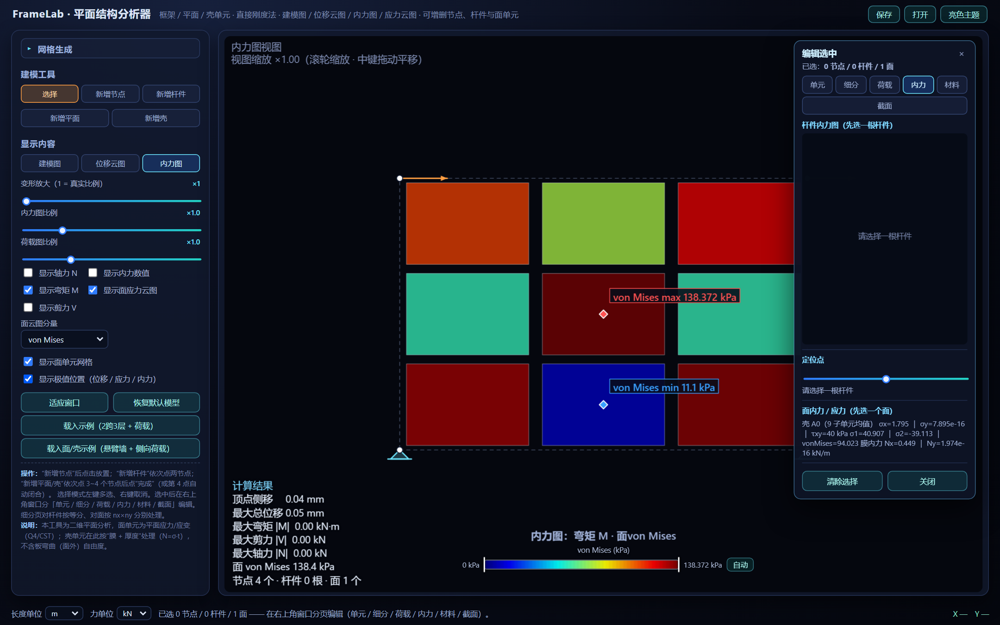


**亮色主题**

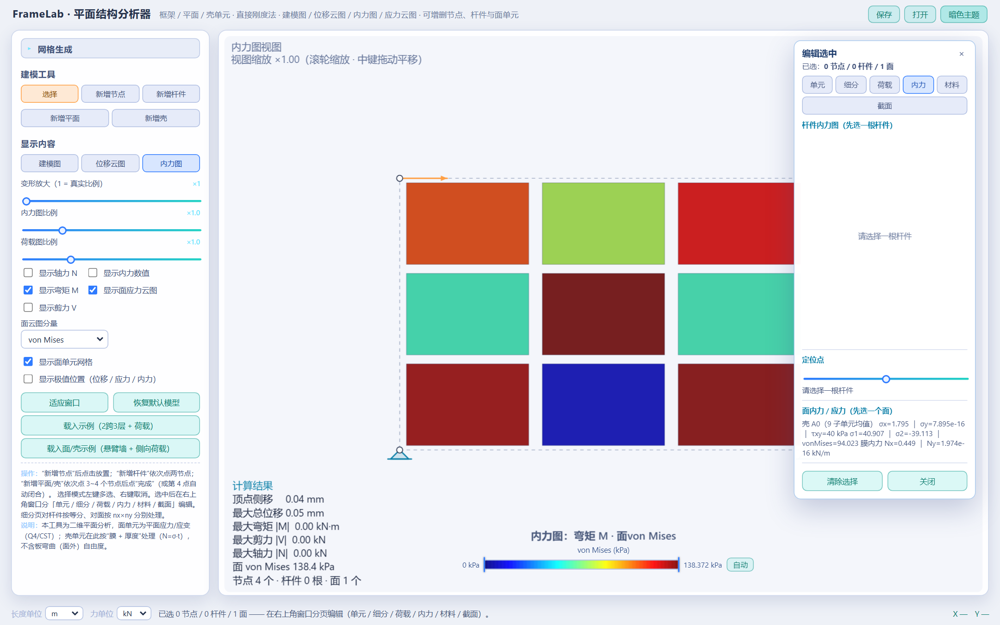

**鼠标悬停数值提示**：悬停杆件或面单元即可实时查看坐标与云图数值

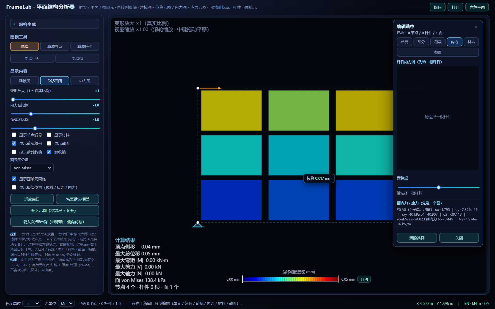

---

## ✨ 功能特性

### 建模
- **网格快速生成**：左侧「网格生成」面板默认收起，点击标题展开，输入跨数、层数、跨度、层高，一键生成多跨多层框架。
- **可交互建模**：图面点击新增节点；依次点选两个节点生成杆件（自动判别柱/梁）；依次点选 3~4 个节点生成**平面单元 / 壳单元**。
- **单元编辑**：移动、复制（带偏移并继承材料/截面/刚度/细分）、删除选中节点/杆件/面。
- **节点坐标编辑**、**单元离散数**（每根杆件划分为若干有限元单元）可调。
- **边界条件**：固定端 / 铰支 / 辊轴（Ux 或 Uz）/ 自由，图形化显示支座。
- **模型保存 / 打开**：右上角「保存」将完整模型（节点、杆件、面、材料、截面、荷载、细分、显示设置、单位等）导出为 JSON 文件；「打开」载入该文件恢复全部状态。
- **多文档标签页**：标题栏下方为计算文件标签，每个标签独立保存一个完整模型与显示设置。点击切换、双击重命名、点 `×` 关闭、点 `+` 新建空白文件；「打开」的 JSON 会作为新的计算文件标签加入，互不干扰。
- **一键示例**：「载入示例」生成 2 跨 3 层带荷载框架；「载入面/壳示例」生成底部固定的悬臂墙 + 侧向荷载。

### 单元类型
| 单元 | 说明 | 节点自由度 |
| --- | --- | --- |
| 框架 Frame | 2 节点 Timoshenko 梁柱单元（含剪切变形） | ux、uz、ry |
| 平面 Plane | Q4 四节点等参元 / CST 常应变三角元，平面应力或平面应变 | ux、uz |
| 壳 Shell | 在此二维分析中按“膜 + 厚度”处理（面内 Q4/CST，膜内力 N = σ·t） | ux、uz |

> 说明：本工具为二维平面（X-Z）分析，不含板弯曲（面外）自由度，故壳单元仅体现膜行为。平面与框架共享节点 ux、uz 自由度，可任意混合建模。

### 细分（选中单元的子菜单）
- 选中**杆件**后，「细分」页可按 **等分数 n** 或 **最大段长 lmax** 加密（覆盖全局“单元数/杆”）。
- 选中**面单元**后，「细分」页可按 **nx × ny 结构化网格（1~50）**或 **最大尺寸 hmax** 加密；四边形面用 nx×ny 网格剖分为 Q4，三角形面按每边 nx 等分剖分为 CST。
- 每个单元的细分覆盖独立存储（`memDiv` / `areaDiv`），「恢复全局」可清除覆盖。
- **物理分割**（真正新增模型节点并拆分单元）**按细分面板当前参数执行，可重复执行逐级加密**：
  - 「⚙ 物理分割杆件」——按等分数在模型层面新增节点并把杆件拆成多段（材料/截面/刚度/荷载自动继承与映射，点/梯形荷载随新分段重新定位）。
  - 「⚙ 物理分割面」——按 nx × ny 在模型层面新增节点并把面拆成 nx×ny 个面单元；**若面周边有重合的框架单元，会按面边缘节点把框架一并分割**，保证网格协调。
  - 分割生成的单元自动记为最小单元（分析时不再临时细分），可在画布上直接看到分割后的单元与框架。

> **框架—面变形协调**：分析前会按坐标合并分析节点（容差 1e-6 m），并让**共边的杆件与面单元取相同细分数**；杆件离散时还会把落在其上的面网格节点投影插入。因此共边节点为同一个自由度，框架与平面/壳的变形严格协调（不再出现面旁杆件“各变各的”）。

### 材料与截面
- **材料库**：钢材 Q235 / Q345、混凝土 C30 / C40、铝 6061，或自定义（弹性模量 E、泊松比 ν）。框架与面单元共用材料库。
- **杆件截面库**：矩形、圆形、工字形（工字形含 h、b、tw、tf 参数），自动计算 **A、I、A_s**。
- **面厚度 / 平面假设**：厚度 t 与 **平面应力 / 平面应变 / 壳-薄板 / 壳-厚板** 四种假设。
- **面细分**：nx × ny（1~50）或最大尺寸 hmax；四边形→Q4，三角形→CST。
- **节点协调**：分析节点按坐标合并（容差 1e-6 m），共边杆件与面取相同细分数，框架与面变形协调。
- 由材料 + 截面导出单元刚度：`EA = E·A`，`EI = E·I`，`GA = G·A_s`，`G = E / 2(1+ν)`；面单元由 `E、ν、t` 组成弹性矩阵 D。
- 亦可在「单元」页直接给出 EA/EI/GA 手动覆盖（覆盖优先于材料/截面，仅框架）。

### 荷载
- **节点荷载**：Fx、Fz、My。
- **杆件荷载**：均布荷载、集中荷载、梯形局部荷载（可叠加多条），并以 SAP2000 风格绘制**箭头 + 外轮廓线**。
- **面荷载**：整体坐标均布面荷载 `qx、qz`（kN/m²，单位面积力），按一致等效节点力转换为节点力（乘厚度 t）。
- 荷载符号、荷载数值可分别开关；**荷载图比例**可缩放。

### 单位与主题
- **单位切换**（底部状态栏）：长度可选 **m / mm**，力可选 **kN / N**。切换后所有输入框、标注、结果与图表单位实时换算（应力随之在 kPa / Pa 间切换，位移以 mm 显示）。
- **亮 / 暗主题**：右上角一键切换（默认**浅色主题**），模型与全部面板、图表同步换肤。
- **状态栏**：显示当前单位、操作提示与鼠标实时坐标。

### 分析
- 二维梁柱单元（含**剪切变形**，Timoshenko 梁，GA→∞ 时退化为欧拉-伯努利梁）。
- 平面/壳单元：Q4 等参元（2×2 高斯积分）与 CST 常应变三角元，中心点应力恢复。
- 杆件荷载按**一致等效节点力**（Hermite 形函数 + 高斯积分）转换；内力沿杆长积分恢复（均布荷载下弯矩为抛物线）。
- 面单元自动约束零刚度钻孔自由度（面内部节点 ry），真实机构仍会被检出（`ok=false`）。

### 可视化
- **建模图 / 位移云图 / 内力图**三种视图：建模图只显示骨架、节点编号、支座与荷载符号。
- **位移云图**（jet 色标）：按节点总位移幅值沿杆件与面单元着色。
- **弯矩图 / 剪力图 / 轴力图**：可多分量叠加显示，**内力图比例**可调，可标注内力数值。
- **面应力云图**：可选 **von Mises / σx / σz / τxz / σ1(最大主应力) / Nx(膜内力)** 分量着色，可按需开关面网格线。
- **拖动式云图色标条**：画布底部色标条可拖拽上下限，单独放大某段色阶范围；「自动」恢复数据全范围。
- **极值位置标注**：勾选「显示极值位置」后，自动在位移、面应力、杆件内力（M/V/N）的极值处标记并标注数值。
- **鼠标悬停数值**：悬停杆件或面单元时，浮出提示框实时显示该截面位移 / 内力 / 应力云图数值。
- **面收缩显示**：「位移云图」子菜单勾选 **面收缩** 后，二维单元向形心收缩显示（SAP2000 风格），便于看清**物理分割**后的单元边界与周边框架单元。
- **内力定位点**：拖动滑杆，在所选杆件上定位并实时显示该截面的 **N / V / M**；右侧面板同时绘制**荷载、轴力、剪力、弯矩四张小图**。
- **面内力 / 应力读取**：选中面单元后在「内力」页显示该面 σx、σz、τxz、主应力、von Mises 与膜内力 Nx、Nz（子单元均值）。
- **材料 / 截面标注**：可在图上显示每根杆件的材料与截面（如 `C30 矩0.2x0.6`），并可显示节点编号与荷载符号。
- **视图缩放 / 平移**：滚轮缩放、中键拖动平移、「适应窗口」复位。
- 结果面板（画布左下角）：顶点侧移、最大总位移、最大弯矩/剪力/轴力、面最大 von Mises、节点/杆件/面数。

### 壳剖面（SAP2000 式截面切割）
- **画线切割**：在图上依次点击起点、终点（近节点吸附、15° 磁吸），积分取剖面穿过的全部壳/面细分单元应力：法向轴力 Fn、切向剪力 Fs、绕中轴弯矩 M（中轴默认取有应力范围中点，可拖拽）。
- **剖面符号**：起点/终点只保留线（无实心点），有意义的边缘实心点画在**画线与壳的交点**；暗色主题选中为黄色，亮色主题为蓝色；内力面板可开关**显示剖面符号**。
- **沿线应力图**：横轴为壳内有效段（从壳边起算）；曲线为各应力柱**中点连线**并向壳边线性外推后折线直连（不与 0 连接、不做光滑），柱中点为空心圆、壳边交点为实心点。
- **探针滑点**：应力图、主图、滑杆三处同步拖动，实时显示该处原始 / 连线应力值。
- **双套积分对比**：`Fn/Fs/M` 与当前分量沿线积分均给出原始分段值与连线值两套（含 Δ 与百分比；原始值≈0 时自动改显示绝对差），可与理论值对照。
- **跟随变形**：位移 / 内力视图下剖面线按变形放大系数跟随变形显示（存储坐标仍为未变形值，分析基准不变）；变形放大滑杆从 **0** 开始（0 = 完全不变形）。
- **对账工具**：「剖面对齐壳中线站」一键把剖面移到所在矩形壳跨中站、中轴定截面中点，与「内力」页壳梁/壳柱跨中值逐项对比（注意两边符号约定不同）；壳梁端站按端斜率外推至真端截面（此前拍平为边柱中点值）。

### 设计后处理（`design.js`，「设计」分页）
- 钢结构（GB50017）与混凝土构件（GB50010）验算：自动提取每根杆件控制内力（三截面最大弯矩处同期 N、V），输出应力比 / 配筋并标注是否超限。
- 层间位移角统计与顶点位移 / 结构高度比；结果汇总面板 + 单构件详细计算书（Markdown）。
- 混凝土构件默认 C30 + HRB400，可改材料、截面与配筋参数后一键重算（`FrameLab.runDesign()`）。

### 交互
- 左键多选、右键取消选择。
- 建模工具：选择 / 新增节点 / 新增杆件（右键或 `Esc` 退出）。
- 壳剖面工具：画线确定起点 / 终点（近节点吸附、15° 磁吸，含 X/Z 轴）。
- 3D 模式：四窗口联动（左键点空处拖动旋转 მთავარი 窗视角、滚轮缩放、中键/Shift+左键平移，双击小窗与大窗互换）；小窗与左侧面板可分别折叠。

### 三维（3D 模式，标题栏 `2D/3D` 切换）
- **四窗口**：`plan（XY 平面）/ secX（X 向剖面）/ secY（Y 向剖面）/ persp（3D 轴测）`，平面位置可在底部状态条调节，切片内外单元自动隐藏。
- **空间杆系**：6 自由度/节点（轴向 + 扭转 + 双向弯曲，欧拉梁）；杆件均布沿局部竖向平面内横向，竖杆沿水平横向。
- **共面膜墙**：XY / XZ / YZ 共面面单元以膜刚度参与计算（含竖向墙，与共边杆件共享节点、变形协调）；真斜面单元由内置求解跳过（精确解走 OpenSees 真 3D 路径）。
- **2D 画布看 3D 模型**：统一按 X-Z 平面投影显示（柱竖梁横），鼠标坐标与拾取一致；`plan` 窗看 X-Z 模型压成一条线属正常（`y=0` 边缘视角），立面请看 `secX` 窗。
- **3D 显示**：杆件按截面拉伸为 3D 实体、壳按厚度显示为实体板（含光照明暗与遮挡），位移 / 内力视图下跟随变形。

---

## 🚀 使用方法

1. 下载或克隆本仓库：

   ```bash
   git clone https://github.com/song4875343/framelab.git
   ```

2. 直接用浏览器打开 `index.html`（推荐 Chrome / Edge / Firefox 最新版），或访问在线演示。

3. 在左侧「网格生成」设置跨数与层数，或使用「新增节点 / 新增杆件」手工建模；亦可点击「载入示例」。

4. 在右侧图面选择节点或杆件，在弹出窗口的 **单元 / 荷载 / 内力 / 材料 / 截面** 分页中进行编辑。

5. 在「显示内容」中切换 **建模图 / 位移云图 / 内力图**，观察变形与内力分布；用量值滑杆、底部色标条与「显示极值位置」细化查看。

6. 需要时在右上角「保存」导出模型 JSON，或「打开」恢复（作为新的计算文件标签）；用标题栏下方的标签页在多个计算文件之间切换（`+` 新建、`×` 关闭、双击重命名）。底部状态栏可切换 **长度 / 力** 单位，右上角可切换 **亮 / 暗主题**。

---

## 🔌 脚本接口（可选）

页面暴露了 `window.FrameLab` 便于嵌入与自动化（例如批量截图）：

```js
FrameLab.demo();              // 载入框架演示模型
FrameLab.demoArea();          // 载入面/壳（悬臂墙）演示模型
FrameLab.setView("disp");     // "model" | "disp" | "force"
FrameLab.selectMember(id);    // 选中指定杆件（null 取首根）
FrameLab.selectArea(id);      // 选中指定面单元（null 取首个）
FrameLab.addArea([n1,n2,n3,n4], "plane");  // 新建面单元（3~4 个节点 id）
FrameLab.physicalMeshArea(id);   // 物理分割面（含周边框架），返回子面 id 数组
FrameLab.physicalMeshMember(id); // 物理分割杆件，返回子杆 id 数组
FrameLab.selectLoaded();      // 选中首根带荷载的杆件
FrameLab.openTab("force");    // 切换弹窗分页：unit | div | load | force | mat | sec
FrameLab.setStation(0.35);    // 定位点位置（0~1）
FrameLab.rebuild();           // 重新分析并重绘
FrameLab.newDoc();            // 新建一个空白计算文件（标签页）
FrameLab.listDocs();          // 列出所有计算文件标签：[{id,name,active}]
FrameLab.switchDoc(id);       // 切换到指定计算文件
FrameLab.openDoc(name, snap); // 以快照打开为新的计算文件（导入/迁移入口）
FrameLab.state();             // 获取模型 / 结果数据
FrameLab.runDesign();         // 按当前规范设置执行钢/混凝土设计，返回 designRes
FrameLab.designResult();      // 获取上次设计结果
FrameLab.solverContext();     // 获取求解器输入 ctx（solver.js 接口）
FrameLab.solverSource();      // 当前结果来源："builtin" | "xara"
FrameLab.setExternalAna(ana, meta); // 接入外部求解器结果并显示
FrameLab.clearExternalAna();  // 回到内置求解器并重算
FrameLab.recomputeDerived();  // 用当前 ana 重算壳梁壳柱参考线与壳剖面
```

---

## 🔌 OpenSees / xara 分析（可选）

内置求解器（`solver.js`，Timoshenko 梁 + Q4/CST，直接刚度法）始终是默认求解器。
左侧「几何」面板、显示选项之后、「操作」之前有 **OpenSees 分析**折叠区，
页面打开时会自动探测求解服务器（http://127.0.0.1:8007），连通显示成功、否则提示未开启。
点击「用 OpenSees 分析」即：

1. `xara.js` 把当前模型导出为 [xara](https://github.com/peer-open-source/xara)（OpenSees Python 接口库）的 `.py` 脚本；
2. POST 到本地桥接服务（`xara_server.py`，默认 http://127.0.0.1:8007），调用 OpenSees 求解；
3. 结果读回并映射为 FrameLab 数据结构，位移 / 内力 / 应力云图 / 壳剖面照常显示；「回到内置求解器」一键切回。

```bash
# 一键启动（仓库根目录双击或执行，Python 3.11~3.13 均可）：
start_server.bat   # uv sync（按 uv.lock 装 xara/opensees/mkl）+ 启动桥接 http://127.0.0.1:8007
```
等价手动流程：`uv sync`，再 `uv run python xara_server.py --port 8007`
（兼静态托管 `index.html`）。依赖声明在 `pyproject.toml`（含 `uv.lock`
锁定文件；`requirements-xara.txt` 为同版本对照表）。
（注：8000 易与其它程序冲突，默认端口已改为 8007。）

> Windows 说明：OpenSeesRT.dll 依赖 `mkl_rt.2.dll` 等 MKL 库；mkl 2026 起只提供
> `mkl_rt.3.dll`，会导致 `xara.Model()` 初始化失败，故 requirements 中把 mkl 上限定死。
> MKL DLL 位于 `.venv\Library\bin`，由导出脚本的 `_bootstrap_dll()` 自动加入搜索路径。

也可「复制脚本」离线运行：`.venv\Scripts\python.exe run_xara.py framelab_xara.py -o results.json`。

### 读取 OpenSees 文件（`opensees_import.js`）

左侧「几何」面板 → OpenSees 分析 →「读取 OpenSees 文件」，可把 OpenSees 模型文件
直接导入为新的计算文件（导入后自动用内置求解器求解，也可再点「用 OpenSees 分析」）。
按扩展名 + 内容自动判定格式，同时兼容：

- **OpenSeesPy（`.py`）**：`ops./op.` 命令；本页导出的 xara 脚本（`model.` 写法）也可读回；
  支持变量赋值 (`E = 3.0e7`) 与简单四则表达式；
- **Tcl（`.tcl`）**：原生 `node/fix/element/load/eleLoad` 命令；
  支持 `set` 变量、`$var`/`${var}` 替换与 `[expr ...]` 四则运算。

支持的命令子集（2D 线弹性静力）：`node / fix / uniaxialMaterial Elastic / section Elastic /
geomTransf Linear / element elasticBeamColumn|forceBeamColumn|dispBeamColumn|truss /
pattern Plain / load / eleLoad -beamUniform|-beamPoint`；求解/输出类命令
（`analyze/recorder/...`）与面/壳单元会被跳过并在导入后提示，不中断导入。

约定：假定文件单位与 FrameLab 内部一致（m / kN / kN·m），不做换算；
杆件荷载沿局部 +z 为正（`udl q` 与 `beamUniform Wy` 直接对应）；
`-beamPoint` 的位置参数按相对长度（0~1）解释（与本页导出一致），落在 (1, L] 内
则按距首节点绝对距离解释；`truss` 按轴向杆导入（EI 取 EA·1e-9 近似）；
刚度以 `memStiff {EA, EI}` 精确覆盖（GA 取 1e12，退化为 Euler 梁，与 OpenSees 一致）。

`example/` 下有两个可直接载入的例子（面板上另有「载入 Py 示例 / 载入 Tcl 示例」按钮）：

- `example/openseespy_portal_frame.py` —— 单跨门式刚架（梁均布 + 侧向节点荷载）；
- `example/tcl_simple_beam.tcl` —— 简支梁（均布 + 跨中集中力，含 `set`/`[expr]` 用法）。

> file:// 方式直接双击打开页面时，浏览器禁 fetch 本地文件，示例会自动经桥接
> 服务器（`GET /api/file`，仅放行 `example/` 目录）中转读取——只要服务器在运行
>（`start_server.bat`），示例按钮照常用；服务器也没开时才会报错。

验证：`node tests/verify_osimport.mjs`（解析 + 内置求解 + 简支梁解析值 `Mmax=77.25` +
xara 导出 roundtrip，一律通过）。

映射关系（均经 xara 0.0.34 真机核对）：纯框架 → `elasticBeamColumn`（ndm=2, ndf=3），
杆件按 `NSUB` / `memDiv` 等分再加杆上节点投影切分（与内置求解器同规则，逐段下单元
与荷载、逐段回填 13 站内力）；端力取 `eleResponse 'localForces'`（单元局部坐标；注意 OpenSeesRT 的 `'forces'` 返回的是
整体坐标端力，竖向/斜杆若误用会导致轴力与剪力互换）；
纯连续体子单元 → `Quad` / `Tri31`（ndm=2, ndf=2，逆时针节点序），应力取节点值平均；
节点荷载 → `load`；杆均布 → `beamUniform`；集中力 → `beamPoint(P, a/L)`；
梯形 → 20 点离散；面荷载 → 与内置求解器同式的一致等效节点力。
政策：只做线弹性（`ElasticIsotropic` + `elasticBeamColumn` + Linear 算法，不引入非线性）。

### 混合模型（3D 退化平面路径，X-Z 平面）

框架—连续体混合模型走 ndm=3、ndf=6 的退化平面路径（`y=0` 平面内建模，与 2D 的 X-Z 平面一致）：
框架为 3D `elasticBeamColumn`（定向向量取 `-Y`，局部 y 落在面内且与 2D 同号，
面内取 `Vy/Mz` 即与 2D 的 `V/M` 同值），
连续体为 `ASDShellQ4` + `ElasticMembranePlateSection` 膜截面；
全部节点约束面外自由度（`uy、rx、rz`），只施加面内荷载（`Fx、Fz、My`，
其中整体 `My = -my_2D`，因 2D 逆时针为正而右手 `+Ry` 为顺时针）。
实测约束（xara 0.0.34 + opensees 0.1.31）：

- `ShellMITC4` 的 stresses/strains 查询返回全零、`ShellDKGQ` 在膜截面下奇异，故选用 `ASDShellQ4`；
- `ASDShellQ4` 的 `'stresses'` 为每高斯点 8 个截面广义力，前 3 个为 `[Nzz, Nxx, Nxz]`
  （X/Z 向拉伸标定），膜应力 = N/t；**Nxz 符号与 2D 相反，回填时已取反**；
- 3D 梁的 `eleLoad`（beamUniform/beamPoint）总量对、分布错（悬臂 UDL 下固端弯矩≈0），
  故杆件荷载一律转为与内置求解器同式的一致等效节点力（Euler 梁 + 等截面下为精确等效）；
- 膜壳的 drilling 刚度约等于零：**梁以“点”方式接入墙面时转角基本不传递（相当于铰接）**；
  共边（逐节点共享）的平动耦合是精确的，框架自身的梁—梁刚接不受影响；
  连梁等点连接场景的刚域加强另行立项；
- 混合模型中的三角形面暂不支持（`ASDShellT3` 在细分网格下偏软约 2~3 倍，已实测），
  会给出明确报错；纯连续体模型的三角形走 2D `Tri31` 路径，不受影响。

### 桥接验证

`node tests/verify_bridge.mjs`（需先装好 `.venv`）自动对比内置求解器与 OpenSees 结果：

| 用例 | 内容 | 结果 |
| --- | --- | --- |
| A | 门式框架 Euler 对标（GA 覆盖退化） | 位移/内力相对误差 < 1e-7 |
| B | 门式框架真实截面（含剪切变形） | 位移 0.7%，内力 2.2%（理论差异：Timoshenko vs 欧拉梁） |
| C | 矩形板均匀拉伸（解析 σx=2000kPa） | 与解析解一致，应力/位移误差 < 1e-4 |
| D | 悬臂墙弯曲（整体平衡 Fx/M0 精确） | 位移 9.5%，应力（除固定端奇异区）13%（列式差异，加密后收敛） |
| E | 三角悬臂 CST | 误差 < 1e-14（与 Tri31 完全一致） |
| F | 混合模型 | 走 3D 退化平面路径（kind=mixed3d） |
| G | 纯框架走 3D 路径 | 位移/内力误差 < 1e-7，面外泄漏为 0（验证节点等效荷载 + My 映射） |
| H | 门框 + 内填墙混合 3D | 位移 2.8%，杆件内力 39%（次要弯矩再分配；漂移、轴力、平衡精确），墙应力 5~11%，平衡精确，泄漏为 0 |
| I | 混合 + 三角形面 | 被明确拒绝（T3 精度不足） |
| J | 共边重复节点回归（两块板并排 + 支座副本） | 求解成功，应力 25% 内（除固定端奇异区）、位移 15% 内、平衡精确 |
| K | 杆件细分（NSUB/memDiv 等分 + 杆中节点投影切分 + 缝上集中力） | 位移/内力误差 < 1e-6（逐段 13 站全对齐） |

> 注：验证过程中暴露并已修复的 bug——① 杆端力误用 `'forces'`（整体坐标），
> 改为 `'localForces'`；② 内置求解器 CST 的 B 矩阵多除以 2（刚度偏小为 1/4，
> 位移偏大约 4 倍、应力偏小约一半），`solver.js` 与 `index.html` 内遗留副本已同步修正；
> ③ 3D 路径站内力须扣除分布荷载固端力（节点等效荷载下单元量测 q=k·u 不含此项）；
> ④ `ASDShellQ4` 的 Nxz 符号与 2D 相反，回填已取反（全场反相关验证）；
> ⑤ 共边重复节点：约束/关联一律按分析节点合并。逐模型节点下 fix 会在重复约束处
> 直接报错退出；若按模型节点判孤立，副本节点会被误判孤立而多加全约束，
> 把共边界面钉死（曾实测 30 米悬臂墙刚度偏大约 84 倍）。另桥接报错现已附带 stderr 尾部。

---

## 📐 计算原理

| 项目 | 说明 |
| --- | --- |
| 框架单元 | 二维梁柱单元（2 节点 × 3 自由度：ux、uz、ry） |
| 平面单元 | Q4 四节点等参元（2×2 高斯积分）/ CST 常应变三角元（ux、uz） |
| 壳单元 | 二维膜 + 厚度（面内 Q4/CST，膜内力 N = σ·t；不含板弯曲） |
| 刚度矩阵 | Timoshenko 梁单元（剪切柔度 φ = 12EI/(GA·L²)）；面单元 `K = ∫ Bᵀ D B t dA` |
| 材料/截面 | 杆件 EA = E·A，EI = E·I，GA = G·A_s（G = E/2(1+ν)）；面 D = D(E, ν) |
| 荷载转换 | 杆件：Hermite 形函数一致等效节点力，4 点高斯积分；面：形函数 × det(J)，2×2 高斯 |
| 内力恢复 | 杆件由 `f = k·T·u − p` 沿杆长积分得 V(x)、M(x)；面由 ε = B·u、σ = D·ε 得 σx、σz、τxz |
| 细分 | 杆件等分/最大段长；面 nx×ny 结构化网格（四边形）/ 每边等分（三角形） |
| 边界条件 | 逐自由度约束（固接 / 铰支 / 辊轴 / 自由）+ 零刚度钻孔自由度自动约束 |
| 求解 | 高斯消元（列主元） |

**单位约定**：内部计算以米 / 千牛为基本单位（长度 m、力 kN、弯矩 kN·m、面荷载 kN/m²、应力 kPa(=kN/m²)、刚度 EA(kN)、EI(kN·m²)、GA(kN)）；界面可通过底部状态栏切换为 **mm / N**，仅影响显示与输入，内部换算自动完成（应变以米计，应力按当前力单位显示为 kPa 或 Pa）。**杆件荷载**垂直杆件、沿杆件**局部 +z 为正**（水平杆向上为正，向下取负值）；节点荷载与面荷载按整体坐标（Fz、qz 向下为负）。

### 面单元应力恢复

Q4 取单元中心点 `ξ=η=0` 的 B 矩阵；CST 为常应变。由节点位移求应变 `ε = B·u`，再由弹性矩阵得应力：

- 平面应力：`σ = D E/(1−ν²) · ε`；平面应变：`σ = D E(1−ν)/((1+ν)(1−2ν)) · ε`
- 主应力 `σ1,2 = (σx+σz)/2 ± √(((σx−σz)/2)² + τxz²)`
- von Mises `σv = √(σx² − σxσz + σz² + 3τxz²)`
- 膜内力（壳）`Nx = σx·t`，`Nz = σz·t`，`Nxz = τxz·t`

### 截面特性公式

| 截面 | A | I | A_s |
| --- | --- | --- | --- |
| 矩形 (b×h) | b·h | b·h³/12 | 5/6·A |
| 圆形 (d) | πd²/4 | πd⁴/64 | 0.9·A |
| 工字形 (h,b,t_w,t_f) | 2b·t_f + (h−2t_f)·t_w | [b·h³ − (b−t_w)(h−2t_f)³]/12 | h·t_w |

---

## 🗂️ 目录结构

```
framelab/
├── index.html              # 主界面（求解器入口为适配器，实现在 solver.js）
├── solver.js               # 自编求解器独立模块：FrameSolver.solve(ctx)（默认求解器）
├── xara.js                 # OpenSees/xara 集成：导出脚本 / 调用桥接 / 回填结果
├── opensees_import.js      # OpenSees 文件读取：OpenSeesPy(.py)/Tcl(.tcl) → 模型快照
├── xara_server.py          # 本地桥接服务（标准库实现）：执行脚本 + 静态托管 + 示例中转
├── run_xara.py             # 命令行离线运行导出的 xara 脚本并提取结果
├── start_server.bat        # 一键启动：uv sync + 运行桥接（默认 8007，可传端口）
├── pyproject.toml + uv.lock# 桥接环境声明与锁定（xara/opensees/mkl）
├── requirements-xara.txt   # 同版本对照表（uv 安装备用）
├── design.js               # 混凝土/钢结构设计后处理模块
├── example/                # 示例文件
│   ├── framelab-*.json              # JSON 模型（框架 / 壳）
│   ├── openseespy_portal_frame.py   # OpenSeesPy 例：单跨门式刚架
│   └── tcl_simple_beam.tcl          # Tcl 例：简支梁（均布+跨中集中力）
├── tests/
│   ├── verify_bridge.mjs   # 桥接验证：内置求解器 vs OpenSees（A~K 用例）
│   ├── verify_true3d.mjs   # 真 3D：内置 3D vs OpenSees 真 3D（位移/全内力）
│   ├── verify_wall3d.mjs   # 3D 竖向墙参与、斜面跳过、共边节点
│   ├── verify_wallx.mjs    # 混合墙真 3D 路径（位移量级对照）
│   ├── verify_moment3d.mjs # 3D 各窗口弯矩方向/受拉侧回归
│   ├── verify_3dsub.mjs    # 3D 细分着色/细分点/壳拾取回归
│   ├── verify_slice.mjs    # 3D 切片窗无平面外杆件、无穿切整杆线
│   ├── verify_osimport.mjs # 导入验证：解析+求解+解析值核对+roundtrip
│   ├── verify_xzmigrate.mjs# X-Z 统一：解析值+新旧一致+旧快照迁移
│   ├── verify_2dof3d.mjs   # 3D 模型在 2D 画布下按 X-Z 显示
│   ├── verify_legacyfiles.mjs # 旧示例文件迁移后数值一致
│   └── verify_phymesh.mjs  # 物理分割回归：面板参数+重复分割（DOM 桩驱动真实页面脚本）
├── docs/                   # 界面截图
│   ├── 01-displacement.png
│   ├── 02-moment.png
│   ├── 03-internal-forces.png
│   ├── 04-section.png
│   ├── 05-material-section.png
│   ├── 06-shell-model.png
│   ├── 07-shell-displacement.png
│   ├── 08-shell-stress.png
│   ├── 09-shell-stress-readout.png
│   ├── 10-stress-extremes.png
│   ├── 11-disp-extreme.png
│   ├── 12-light-theme.png
│   └── 13-hover-value.png
├── README.md
└── LICENSE
```

---

## 🧪 验证

自动化测试（仓库根目录执行，一律 `RESULT: ALL PASS` 为通过）：

- `node tests/verify_bridge.mjs` —— 内置求解器 vs OpenSees 真机对比（A~K，含杆件细分 Case K；需先 `uv sync` 配好 `.venv`）；
- `node tests/verify_osimport.mjs` —— OpenSees 文件解析 + 内置求解 + 简支梁解析值 + xara 导出 roundtrip；
- `node tests/verify_xzmigrate.mjs` —— X-Z 统一专项：新方案解析值（悬臂 `M=qL²/2`、端部位移 `qL⁴/8EI`、简支梁 `qL²/8`、面拉伸 `σx=2000`）+ 新旧方案数值一致 + 旧快照迁移；
- `node tests/verify_2dof3d.mjs` —— 3D 模型在 2D 画布下按 X-Z 平面显示（柱竖梁横、顶梁投影重合）；
- `node tests/verify_legacyfiles.mjs` —— 旧示例文件经迁移打开后数值一致；
- `node tests/verify_phymesh.mjs` —— 物理分割回归：最小 DOM 桩加载真实页面脚本，驱动真实按钮 handler，验证分割采用面板参数、可重复加密、分割后仍可求解；
- `node tests/verify_true3d.mjs` —— 真 3D：内置 6 自由度求解 vs OpenSees 真 3D（位移 1e-15、N/Vy/Vz/My/Mz/T 量级一致）；
- `node tests/verify_wall3d.mjs` / `verify_wallx.mjs` —— 3D 竖向墙膜刚度参与、斜面跳过、梁墙共边节点；
- `node tests/verify_moment3d.mjs` / `verify_3dsub.mjs` / `verify_slice.mjs` —— 3D 弯矩方向、细分着色、切片窗回归。

内置算例已与解析解核对：

- 悬臂梁均布荷载：端部挠度 `qL⁴/(8EI)`、固端弯矩 `qL²/2`；
- 简支梁均布荷载：跨中弯矩 `qL²/8`；
- 简支梁跨中集中力：跨中弯矩 `PL/4`；
- 多跨多层框架：柱底剪力之和 = 总水平力（平衡校验）；
- **平面应力矩形拉伸**：σx、端部位移与解析解 `σL/E` 精确吻合（Q4 单元误差 0.000%）；
- **壳（膜）矩形拉伸**：应力与位移与解析解吻合；
- **面细分收敛**：nx=1 与 nx=6 轴向应力均收敛到解析值 10000 kPa；
- **框架 + 面混合**：刚度矩阵非奇异，位移与应力合理；
- **框架—面共边协调**：共边处杆件与面取相同细分数且节点按坐标合并（底边节点数与杆件子单元数一致）；
- **物理分割**：面 nx=2 分割为 4 个面单元、周边 4 根框架各拆为 2 段、节点 4→9；杆件物理分割段数与面板参数一致，且可重复执行逐级加密（`verify_phymesh.mjs` 回归覆盖）；
- **面收缩显示**：勾选后二维单元收缩渲染正常，无异常；
- **模型保存 / 打开**：保存的 JSON 重新载入后模型、荷载、细分、单位与显示设置完整还原；
- **多文档标签页**：新建 / 切换 / 关闭 / 重命名正常，各标签模型与显示设置相互独立不串扰；「打开」文件会新建标签；关闭最后一个标签自动重建空白文件；
- **单位切换**：m↔mm、kN↔N 切换后输入框、标注与结果实时换算，数值一致；
- **云图色标条**：拖动上下限后色阶范围正确收窄，「自动」可恢复数据全范围；
- **极值标注 / 悬停提示 / 亮色主题**：极值位置与数值正确，悬停数值与所选截面一致，主题切换各处渲染正常。
- **壳剖面**：常数场下连线积分 = 原始积分；线性场下壳边外推精确还原端值、两套积分一致；壳间空隙分块断开、探针显示无应力；剖面线往返变形换算收敛；端部外推后壳梁端站与精确裁剪一致。

---

## 🆚 与 SAP2000 对比（线性静力分析交互）

定位不同：SAP2000 是通用商业有限元平台，FrameLab 是轻量交互式线弹性分析器。下面只谈**线性静力 + 建模交互**这个交集。

### FrameLab 占优的地方

- **零安装、即开即用**：浏览器打开就是完整环境，无许可、无安装、无项目配置；学生/快速校核场景 1 分钟可出第一个结果。
- **编辑即重算**：任何建模/荷载/截面修改都即时重新求解并刷新全部云图/内力图；SAP2000 需要手动 Run，且结果与模型版本需自行对应。
- **结果探查密度高**：截面定位滑杆 + 荷载/轴力/剪力/弯矩四联小图、鼠标悬停截面数值、底部色标条拖拽收窄量程、极值自动标注——看内力分布比 SAP2000 切剖面/查表更快。
- **壳剖面切割**：画线即得 `Fn/Fs/M`，原始分段值与连线值双套积分对账、探针三处联动，是对标 SAP2000 section cut 的轻量实现，小模型对账很顺手。
- **可验证性**：内置求解器 ↔ OpenSees 一键对照（`verify_bridge` 全用例通过）+ 11 个自动化回归测试；商业软件给不出这种白盒对照链。
- **开放与可嵌入**：MIT 开源 + `window.FrameLab` 脚本接口，可做批量截图/教学演示页。

### 不如 SAP2000 的地方（诚实清单）

- **分析类型**：仅线弹性静力。无模态/屈曲/反应谱/时程/P-Δ/施工阶段/几何材料非线性——这是最大的代差。
- **单元库**：无实体单元；2D 壳只有膜行为、无板弯曲；无拉索（只拉不受压）、弹簧/阻尼器/隔震支座、刚性隔板、节点刚域与偏心（连梁刚域已立项未做）；无温度/预应力/沉降/移动荷载。
- **荷载与工况管理**：单工况直接求解，无荷载工况/组合/包络；多方案对比只能靠多文档标签页人肉管理。
- **建模效率工具**：有点选建模和网格生成，但无表格化数据编辑（SAP2000 的表格粘贴改模型极快）、无复制/阵列/拉伸/剖分高级操作、**无撤销重做**（误操作只能重来，这是当前最痛的交互短板）。
- **规模与性能**：稠密高斯列主元消元，几百自由度内秒解，上万自由度会明显变慢；SAP2000 稀疏求解器轻松应对十万级自由度。
- **输出与设计**：无报表/数据库表格/结果动画；设计后处理只有 GB 钢/混凝土、覆盖面远小于 SAP2000 的多规范设计 + 优化模块。
- **生态**：无 OAPI 级二次开发接口、无官方验证手册（本项目的验证靠自建 `tests/` 覆盖）。

### 后续路线（按性价比排序）

1. 撤销重做 + 表格化节点/荷载编辑；2. 荷载组合与包络；3. 2D 壳补板弯曲、连梁刚域；4. 稀疏求解（规模）；5. 结果表格导出/报表；非线性与动力只走 OpenSees 桥接（不自研求解器）。

---

## 🛠️ 技术栈

- 原生 **HTML + CSS + JavaScript**，无任何第三方库或构建步骤；
- Canvas 2D 渲染。

---

## 📄 许可证

本项目以 **MIT License** 开源，可自由使用、修改与分发。

---

## 🤝 贡献

欢迎提交 Issue 与 Pull Request。若这个工具对你有帮助，欢迎点一个 ⭐。
